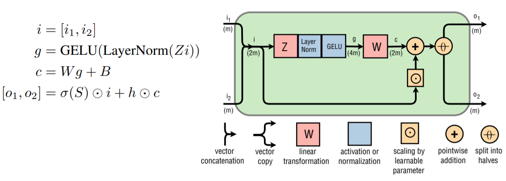
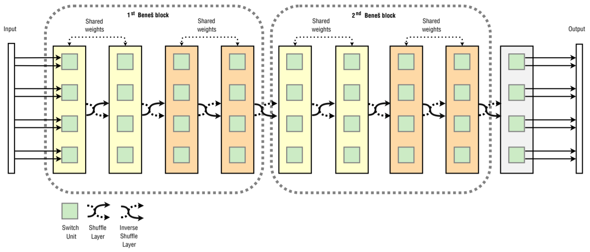

# Residual Shuffle-Exchange Networks: Official _TensorFlow_ Implementation

This repository contains the official _TensorFlow_ implementation of the following paper:

>**Residual Shuffle-Exchange Networks for Fast Processing of Long Sequences**
>
> by Andis Draguns, Emīls Ozoliņš, Agris Šostaks, Matīss Apinis, Kārlis Freivalds
>
> [[AAAI](https://ojs.aaai.org/index.php/AAAI/article/view/16890)] [[arXiv](https://arxiv.org/abs/2004.04662)] [[BibTeX](#citing-residual-shuffle-exchange-networks)]
>
>Abstract: _Attention is a commonly used mechanism in sequence processing, but it is of O(n²) complexity which prevents its application to long sequences. The recently introduced neural Shuffle-Exchange network offers a computation-efficient alternative, enabling the modelling of long-range dependencies in O(n log n) time. The model, however, is quite complex, involving a sophisticated gating mechanism derived from the Gated Recurrent Unit._
>
>_In this paper, we present a simple and lightweight variant of the Shuffle-Exchange network, which is based on a residual network employing GELU and Layer Normalization. The proposed architecture not only scales to longer sequences but also converges faster and provides better accuracy. It surpasses the Shuffle-Exchange network on the LAMBADA language modelling task and achieves state-of-the-art performance on the MusicNet dataset for music transcription while being efficient in the number of parameters._
>
>_We show how to combine the improved Shuffle-Exchange network with convolutional layers, establishing it as a useful building block in long sequence processing applications._

# Introduction

_Residual Shuffle-Exchange networks_ are a simpler and faster replacement for the recently proposed _Neural Shuffle-Exchange network_ architecture. It has O(*n* log *n*) complexity and enables processing of sequences up to a length of 2 million symbols where standard methods fail (e.g., attention mechanisms). The _Residual Shuffle-Exchange network_ can serve as a useful building block for long sequence processing applications.

# Demo

Click the gif to see the _[full video](https://youtu.be/RAu2p9xZiM4)_ on YouTube:

<a href="https://youtu.be/RAu2p9xZiM4"></a>

# Preview of results

Our paper describes _Residual Shuffle-Exchange networks_ in detail and provides full results on long binary addition, long binary multiplication, sorting tasks, the _LAMBADA_ question answering task and multi-instrument musical note recognition using the _MusicNet_ dataset.

Here are the accuracy results on the _[MusicNet](https://zenodo.org/record/5120004)_ transcription task of identifying the musical notes performed from audio waveforms (freely-licensed classical music recordings):

| **Model** | **Learnable parameters (M)** | **Average precision score (%)** |
| ------ | ------ | ------ |
| _cgRNN_ | 2.36 | 53.0 |
| _Deep Real Network_ | 10.0 | 69.8 |
| _Deep Complex Network_ | 8.8 | 72.9 |
| _Complex Transformer_ | 11.61 | 74.22 |
| _Translation-invariant net_ | unknown | 77.3 |
| **Residual Shuffle-Exchange network** | **3.06** | **78.02** |

Note: Our used model achieves state-of-the-art performance while being efficient in the number of parameters using the audio waveform directly compared to the previous state-of-the-art models that used specialised architectures with complex number representations of the Fourier-transformed waveform.

Here are the accuracy results on the _[LAMBADA](https://www.aclweb.org/anthology/P16-1144)_ question answering task of predicting a target word in its broader context (on average 4.6 sentences picked from novels):

| **Model** | **Learnable parameters (M)** | **Test accuracy (%)** |
| ------ | ------ | ------ |
| Random word from passage | - | 1.6 |
| _Gated-Attention Reader_ | unknown | 49.0 |
| _Neural Shuffle-Exchange network_ | 33 | 52.28 |
| **Residual Shuffle-Exchange network** | **11** | **54.34** |
| _Universal Transformer_ | 152 | 56.0 |
| Human performance | - | 86.0 |
| _GPT-3_ | 175000 | 86.4 |

Note: Our used model works faster and can be evaluated on 4 times longer sequences using the same amount of GPU memory compared to the _Shuffle-Exchange network_ model and on 128 times longer sequences than the _Universal Transformer_ model.

# What are _Residual Shuffle-Exchange networks_?

_Residual Shuffle-Exchange networks_ are a lightweight variant of the continuous, differentiable neural networks with a regular-layered structure consisting of alternating _Switch_ and _Shuffle_ layers that are _[Shuffle-Exchange networks](https://github.com/LUMII-Syslab/shuffle-exchange)_.

The _Switch Layer_ divides the input into adjacent pairs of values and applies a _Residual Switch Unit_, a learnable 2-to-2 function, to each pair of inputs producing two outputs, employing _GELU_ and _Layer Normalization_.

Here is an illustration of a _Residual Switch Unit_, which replaces the _Switch Unit_ from _Shuffle-Exchange networks_:

****

The _Shuffle Layer_ follows where inputs are permuted according to a perfect-shuffle permutation (i.e., how a deck of cards is shuffled by splitting it into halves and then interleaving them) – a cyclic bit shift rotating left in the first part of the network and (inversely) rotating right in the second part.

The _Residual Shuffle-Exchange network_ is organized in blocks by alternating these two kinds of layers in the pattern of the _Beneš network_. Such a network can represent a wide class of functions including any permutation of the input values. 
 
Here is an illustration of a whole _Residual Shuffle-Exchange network_ model consisting of two blocks with 8 inputs:

****


# Running the experiments

Running the experiments requires the dependencies to be installed and the following system requirements.

## System requirements

- _Python_ 3.6 or higher.
- _TensorFlow_ 1.14.0.

## Training

To start training the _Residual Shuffle-Exchange network_, run the terminal command:
```
python3 trainer.py
```

By default it will train on the binary addition task. To select the sequence processing task for which to train the _Residual Shuffle-Exchange network_, edit the `config.py` file that contains various hyperparameter and setting options.

## Music transcription

For the _MusicNet_ music transcription task uncomment the corresponding settings in `config.py`:
```
"""Recommended settings for MusicNet"""
# task = "musicnet"
# n_Benes_blocks = 2  # depth of the model
...
```
If you have not downloaded and parsed the _MusicNet_, running trainer.py will do it automatically if `task` is set to `'musicnet'` in `config.py`. This might take a while. If you run out of RAM (it can take more than 40GB), you can download `musicnet.npz` from [Kaggle](https://www.kaggle.com/imsparsh/musicnet-dataset/version/1?select=musicnet.npz) and place it in the `musicnet_data` directory.

If you have enough RAM to load the entire dataset (can be more than 128GB), set `musicnet_subset` to `False` for faster training. Increasing `musicnet_window_size` requires more RAM and trains slower but produces greater accuracy.

To test the trained model for the _MusicNet_ task on the test set, run `tester.py`. To transcribe a custom wav file to MIDI, run:
```
python3 transcribe.py yourwavfile.wav
```

## _LAMBADA_ task

For the _LAMBADA_ question answering task uncomment the corresponding settings in `config.py`:
```
"""Recommended settings for lambada"""
# task = "lambada"
# n_input = lambada_vocab_size
...
```
To download the _LAMBADA_ dataset see the original publication by [Paperno et al](https://www.aclweb.org/anthology/P16-1144).

To download the pre-trained _fastText_ 1M English word embedding see the [downloads section](https://fasttext.cc/docs/en/english-vectors.html) of the _FastText_ library website and extract to directory listed in the `config.py` file variable `base_folder` under “Embedding configuration”:
```
"""Embedding configuration"""
use_pre_trained_embedding = False
base_folder = "/host-dir/embeddings/"
embedding_file = base_folder + "fast_word_embedding.vec"
emb_vector_file = base_folder + "emb_vectors.bin"
emb_word_dictionary = base_folder + "word_dict.bin"
...
```

To enable the pre-trained embedding change the `config.py` file variable `use_pre_trained_embedding` to `True`.

## Windows

If you are running _Windows_, before starting training the _Residual Shuffle-Exchange network_ edit the `config.py` file to change the directory-related variables to _Windows_ file path format in the following way:
```
...
"""Local storage (checkpoints, etc)"""
...
out_dir = ".\host-dir\gpu" + gpu_instance
model_file = out_dir + "\\varWeights.ckpt"
image_path = out_dir + "\\images"
...
```
 If you are doing music transcription on _Windows_, directory-related variables in files related to _MusicNet_ would need to be changed in a similar manner.

# Citing _Residual Shuffle-Exchange networks_

If you use _Residual Shuffle-Exchange networks_, please use the following _BibTeX_ entry when citing the paper:
```
@inproceedings{draguns2021residual,
  title={Residual Shuffle-Exchange Networks for Fast Processing of Long Sequences},
  author={Draguns, Andis and Ozoli{\c{n}}{\v{s}}, Em{\=\i}ls and {\v{S}}ostaks, Agris and Apinis, Mat{\=\i}ss and Freivalds, Karlis},
  booktitle={Proceedings of the AAAI Conference on Artificial Intelligence},
  volume={35},
  number={8},
  pages={7245--7253},
  year={2021}
}
```

# Contact information

For help or issues using _Residual Shuffle-Exchange networks_, please submit a _GitHub_ issue.

For personal communication related to _Residual Shuffle-Exchange networks_, please contact Kārlis Freivalds ([karlis.freivalds@lumii.lv](mailto:karlis.freivalds@lumii.lv)).
